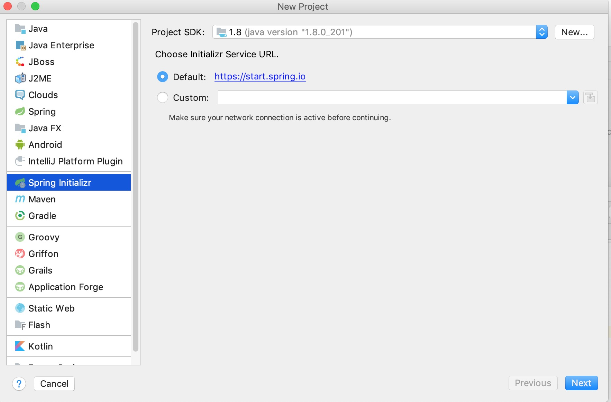

# 使用环境
1. jdk 8
2. maven 3.6
3. 编辑器 idea

## 提前准备

* RabbitMQ  
    mac环境下 （brew 安装）brew install rabbitmq  
    brew services start rabbitmq  
    默认用户名和密码：guest,guest
* nacos  
    https://github.com/alibaba/nacos/releases 
    nacos-server-1.1.4.zip 
    解压 
    目录 bin中 
    sh startup.sh -m standalone 
    配置文件查看端口v
    http://127.0.0.1:8001/nacos 
    使用用户名密码登陆
* redis 
    mac环境下 
        brew install redis

## 新建项目
  
